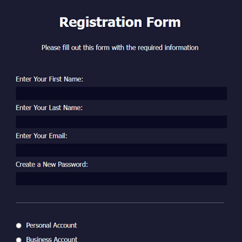

# FreeCodeCamp - Registration Form

This is a solution to the [Registration Form](https://www.freecodecamp.org/learn/2022/responsive-web-design/learn-html-forms-by-building-a-registration-form/) course on [FreeCodeCamp](https://www.freecodecamp.org/).

## Table of contents

- [Overview](#overview)
  - [The challenge](#the-challenge)
  - [Screenshot](#screenshot)
  - [Links](#links)
- [My process](#my-process)
  - [Built with](#built-with)
  - [How to install and run](#how-to-install-and-run)
- [Author](#author)
- [License](#license)

## Overview

### The challenge

"Learn HTML forms by building a registration form."

### Screenshot



### Links

- Code URL: [Github](https://github.com/cekstedt/FreeCodeCamp-Registration-Form)
- Live Site URL: [Netlify](https://astounding-liger-b30074.netlify.app/)
- Challenge URL: [FreeCodeCamp](https://www.freecodecamp.org/learn/2022/responsive-web-design/learn-html-forms-by-building-a-registration-form/)

## My process

### Built with

- Semantic HTML
- CSS

### How to install and run

This project is HTML & CSS only, so simply clone the repo then open `src/index.html` in your browser.

```
git clone https://github.com/cekstedt/FreeCodeCamp-Registration-Form.git
```

## Author

- FreeCodeCamp - [@cekstedt](https://www.freecodecamp.org/cekstedt)

## License

- FreeCodeCamp material is licensed under the [BSD-3-Clause](https://github.com/freeCodeCamp/freeCodeCamp/blob/main/LICENSE.md) license.
